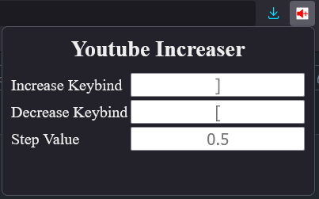

# youtube-volume-increaser 
A simple firefox extension to add a volume multiplier to youtube video controls via javascript injection. 
 
Keybind Defaults (on hover only): 
&emsp;] - Increase 
&emsp;Scroll_up - Increase 
&emsp;[ - Decrease 
&emsp;Scroll_down - Decrease 
&emsp;Left_click - Reset to 1.0 multiplier 
 
Default Step Value: 0.5 
Max Multiplier: 8 
 
Keybinds and step value can be changed in extension toolbar menu. 
 
.xpi file can be used to install for firefox (in Firefox folder) 
 
 

